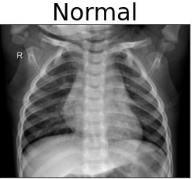
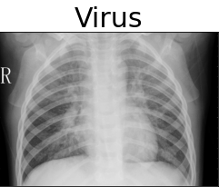
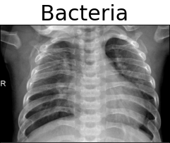

# Pneumonia Detection from Chest X-Rays

## Background

Pneumonia is an infection that inflames the air sacs in one or both lungs. The air sacs may fill with fluid or pus (purulent material), causing cough with phlegm or pus, fever, chills, and difficulty breathing. A variety of organisms, including bacteria, viruses and fungi, can cause pneumonia.  Pneumonia can range in seriousness from mild to life-threatening. It is most serious for infants and young children, people older than age 65, and people with health problems or weakened immune systems.  Diagnosis of pnemonia is typically done from one or a combination of the following:

+ Blood tests
+ Chest X-ray
+ Pulse oximetry
+ Sputum test
+ CT scan
+ Pleural fluid culture

Src: [Mayo Clinic](https://www.mayoclinic.org/diseases-conditions/pneumonia/diagnosis-treatment/drc-20354210)

## Problem
While doctors typically do well at making diagnosis via Chest X-ray they are humans who are often overworked and can suffer from fatigue which can hamper their ability to make a proper diagnosis. A machine learning model can be used to help reduce the false negative rate by acting as a second opinion. In this notebook we will attempt to create said model.

## Success Metrics
Our main goal is to minimize false negatives (True: Pneumonia, Predicted: Normal). A search was done to try to determine false negative rates by medical professionals, but that yeilded mixed results. We have arbitrarily chosen 2% as our maximum allowed rate of false negatives. The reasoning being that in order for a model to be trusted by a medical professional, it must perform exceptionally well.

Secondary goal is to minimize false positives. Again, no false positive rate was discovered for medical professionals, so we will be arbitrarily chosing this value which will be set at 10% being the maximum allowable amount of false positives.

We would also like our model to be able to differentiate between different causes of pneumonia, however, we will not be factoring this into our success metrics.

## Data

The dataset we will be using consists of approximately 6000 images of chest xrays to train a convolutional neural network to detect whether a person has virus-related pnemonia, bacteria-related pnemonia, or neither.

The dataset is [located here.](https://www.kaggle.com/praveengovi/coronahack-chest-xraydataset)

Let's take a look at some example images:

### Distribution of our data
Our classes are distributed like so:

## Modeling

### Input Pipeline
We don’t have much data, so we need to get the most out of what we have. We will use augmentation to artificially create more data.
Here's our data augmentation pipeline:
+ Scale/Resize
+ Random Crop
+ Random Horizontal Flip
+ Random Jitter (brightness and contrast)
+ Random Rotation (15 degrees)
+ Standardization (x - mean / std)

Here's some images after the transformations:

### The Model
Transfer Learning is a very popular technique in computer vision (and also increasingly popular in NLP after the introduction of transformer models). The basic idea is to take a model that has been trained on a very large dataset for many many epochs and 'fine-tune' it for a narrower problem. Often times these models have been trained on something like [ImageNet](https://en.wikipedia.org/wiki/ImageNet) which has ~14million images and over 20k categories. The fine-tuneing involves removing the final output layer, replacing it with your own (in our case a fully connected layer with 3 nodes) and then unfreezing various layer weights so that they can learn more about your images.

Both ResNet18 and ResNet50 were tested.  The latter of the two tended to overfit, so more time was spent fine tuneing the former.

## Results
The unfrozen layers were trained over 25 epochs.  Here are the results:

Now let's take a look at some of the incorrectly classified images:

As you can see, this isn't exactly an easy task.  As a non-medical expert, it seems almost impossible to find any kind of distinguishing features.

## Conclusion
The goal of this project was to train a model which could potentially be used to aid doctors in diagnosing various types of pneumonia from viewing a chest x-ray.  We had arbitrarily chosen the following metrics to determine success:

+   False Negative rate < 2%
+   False Positive rate < 10%

Our model was able to acheive the first goal of <2% FNR, however, it was unable to achieve the second goal with the FPR sitting at 17%.  Due to the FPR being too high, we do not yet feel that this model is ready to be used in production.  Thankfully, there is still room to grow.  We will cover that next.

## Next Steps
Deep learning algorithms are very data hungry, so one of the major bottlenecks in this project was having enough data. We scored fairly well on our success metrics with the data we had, but having more would likely help to improve the model.

The loss function chosen was Categorical Cross Entropy, which does not minimize for our success metrics. Creating a custom loss function could possibly work better. This was not explored due to time constraints.

Our model was trained on only three categories (normal, virus, bacteria), however, our dataset actually included multiple other subcategories such as COVID-19. Unfortunately, the amount of samples for these other sub-classes were too low to be able to use them as their own standalone category for training. Possible datasets have been identified, however, due to time constraints, they were not included. This is something that we would like to explore further.
